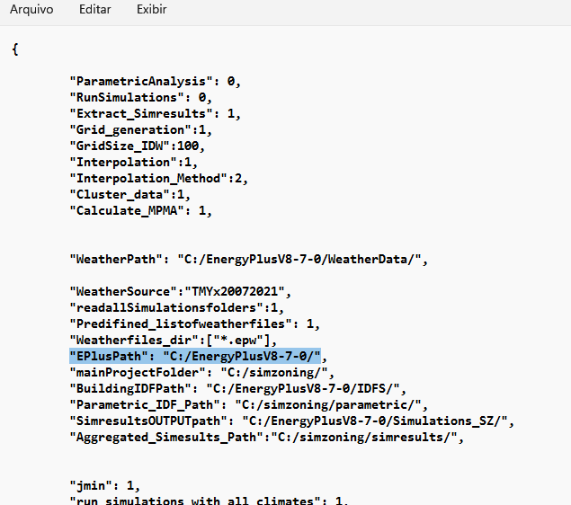
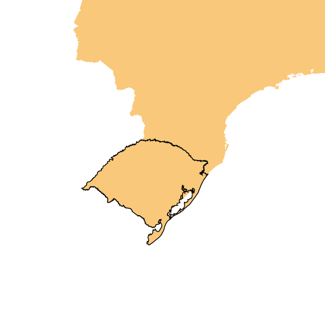

**EnergyPlus Version 8.3 is required.**

1.  **Example 1 Brazil**
* Zoning the state of Rio Grande do Sul, in Brazil.
* All settings are included in the file BRA_RGS.zon.

2.  **Files required**

|                        |   File          |   Location               |
|------------------------|-----------------|--------------------------|
| 1.  Input file         | BRA_RGS.zon     | simzoning\\              |
| 2.  Shape file of the State of Rio Grabde do Sul | BRA_RGS.shp     | simzoning\GISfiles\\AreaOfStudy\\               |
| 3.  Weather files of   the area of   study and   surroundings | 35 .EPW files   | simzoning\\Weatherfiles\\                        |
| 4.  Idf files          | ModelHVAC.idf   ModelNV.idf  | simzoning\\IDFs\\BRAZIL_IDFS\\                   |
| 5.  Alternative method   for comparison| DegreeDays_Brazil.shp   GT_Brazil.shp         | simzoning\\GISfiles\CZ_Methods_Comparison\\     |
| 6.  File containing coordinates   of Brazilian   municipalities  | MunicipiosBrasil.csv           | simzoning\\grid_input\\              |

3.  **Steps**

a.  Create a folder C:/simzoning to unzip simzoning files.

b.  Confirm the path of EnergyPlus Version 8.7 installed in the
    computer. If necessary, rewrite the path in the BRA_RGS.zon file
    used as input data to run this example.
    

<b>Figure 1 Input data file BRA_RGS.zon </b>
 </d1>

.

c.  Call simzoning from MATLAB with the BRA_RGS.zon file as input data.
* 35 Epws 
* 2 models 
* 5 Performance indicators
* No Macrozones
* 4 Zones
* Estimated runtime 1 hour
    
     
 <d1>

 </d1>   

d.  **Expected results**
    
A Region with 4 Zones considering 3 Zoning resolution. A) Clustering
based on points, b) clustering based on municipalities and c) clustering
based on interpolated data.

<d1>
<b>Figure 2 Clustering based on isolated locations </b>
 </d1>

<d1>
<b>Figure 3 Isolated locations zoning boxplot </b>
 </d1>

<d1>
<b>Figure 4 Clustering based on municipalities </b>
 </d1>

<d1>
<b>Figure 5 Zoning based on municipalities boxplot </b>
 </d1>

<d1>
<b>Figure 6 Clustering based on a regular grid of interpolated data (ANN
interpolation method)</b>
 </d1>

<d1>
<b>Figure 7 Zoning based on a regular grid boxplot </b>
 </d1>

<d1>
<b>Figure 8 MPMA of clustering results compared to the Degreedays zoning
and the GT zoning for the area under study </b>
 </d1>

See PDF file Rio Grande do Sul_ANN_Report.pdf in the output folder:
simzoning/Outputs/ Rio_Grande_do_Sul_CaseStudy, for further details
about expected results.
