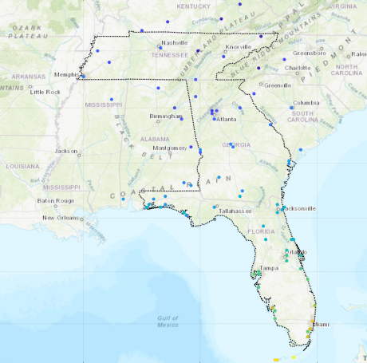
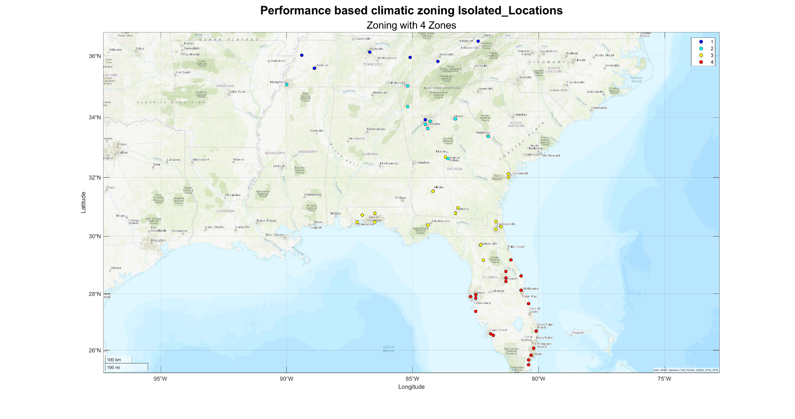
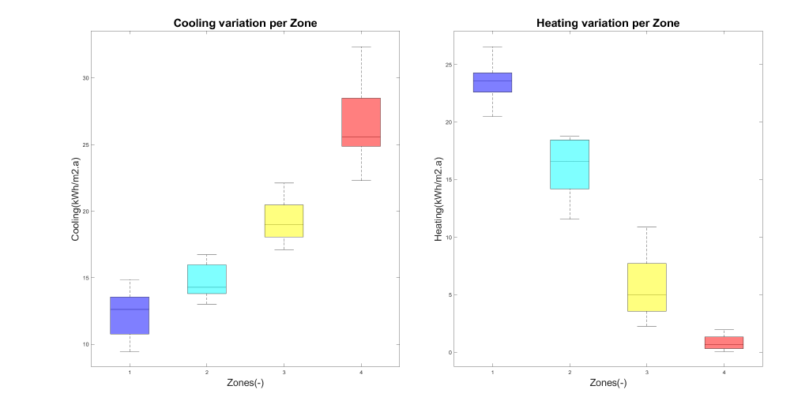
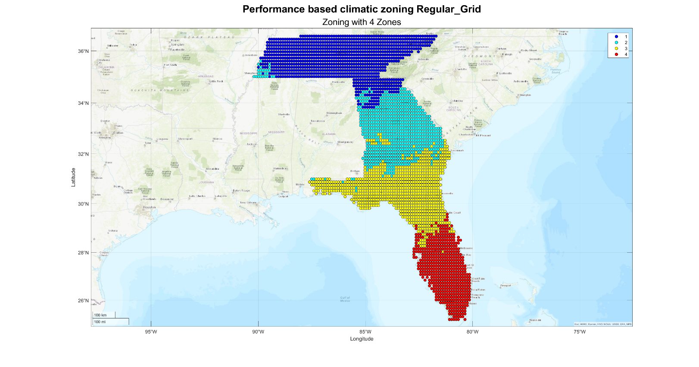
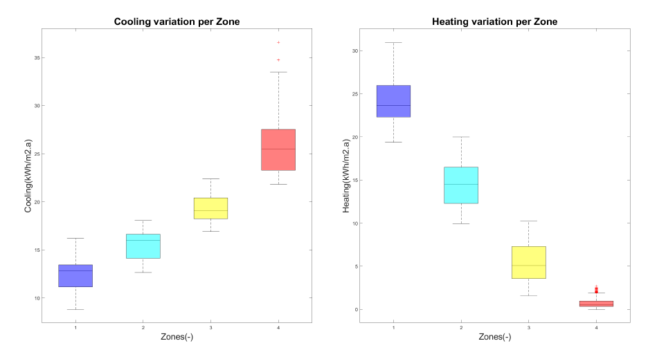
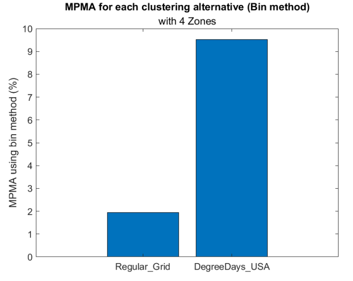

**EnergyPlus Version 8.3 is required.**

1.  **Example 1 USA**

> Zoning the states of Florida, Georgia, and Tennessee.
>
> All settings are included in the file **USA.zon**.

2.  **Files required:**

<table>
<colgroup>
<col style="width: 27%" />
<col style="width: 26%" />
<col style="width: 46%" />
</colgroup>
<thead>
<tr class="header">
<th></th>
<th><strong>File</strong></th>
<th><strong>Location</strong></th>
</tr>
</thead>
<tbody>
<tr class="odd">
<td><ol type="1">
<li><blockquote>

Input file

</blockquote></li>
</ol></td>
<td>USA.zon</td>
<td>simzoning\</td>
</tr>
<tr class="even">
<td><ol start="2" type="1">
<li><blockquote>

Shape file of the States of Florida, Georgia, and Tennessee

</blockquote></li>
</ol></td>
<td>USA_States.shp</td>
<td>simzoning\GISfiles\AreaOfStudy\</td>
</tr>
<tr class="odd">
<td><ol start="3" type="1">
<li><blockquote>

Weather files of the area of study and surroundings

</blockquote></li>
</ol></td>
<td>87 .EPW files</td>
<td>simzoning\Weatherfiles\</td>
</tr>
<tr class="even">
<td><ol start="4" type="1">
<li><blockquote>

Idf. files

</blockquote></li>
</ol></td>
<td>
AptMidRise1A.idf

AptMidRise2A.idf

AptMidRise3A.idf

AptMidRise4A.idf
</td>
<td>simzoning\IDFs\USA_IDFS</td>
</tr>
<tr class="odd">
<td><ol start="5" type="1">
<li><blockquote>

EnergyPlus Version

</blockquote></li>
</ol></td>
<td>8-3-0</td>
<td></td>
</tr>
<tr class="even">
<td><ol start="6" type="1">
<li><blockquote>

Alternative method for comparison

</blockquote></li>
</ol></td>
<td>DegreeDays_USA.SHP</td>
<td>simzoning\GISfiles\CZ_Methods_Comparison\</td>
</tr>
</tbody>
</table>

3.  **Steps**

- Create a folder C:/simzoning to unzip simzoning files.

- Confirm the path of EnergyPlus Version 8.3 installed in the computer.
  If necessary, rewrite the path in the USA.zon file used as input data
  to run this example.

- Call simzoning with the USA.zon file as input data from MATLAB.

<table>
<colgroup>
<col style="width: 60%" />
<col style="width: 39%" />
</colgroup>
<thead>
<tr class="header">
<th colspan="2"><blockquote>

Case study summary

</blockquote></th>
</tr>
</thead>
<tbody>
<tr class="odd">
<td rowspan="2"><blockquote>

</blockquote></td>
<td><blockquote>

87 Epws

</blockquote></td>
</tr>
<tr class="even">
<td><blockquote>

4 models

2 Performance indicators

(Annual energy demand for cooling and heating.)

4 Zones

Number of processors: 4

Time estimation 6 hours

</blockquote></td>
</tr>
</tbody>
</table>

4.  **Expected results**

> A Region with 4 Zones considering 2 Zoning resolution. A) Clustering
> based on points, b) clustering based on interpolated data.
>
>  style="width:6.17222in;height:3.77391in" />
>
> Figure 1 Clustering considering points and interpolated data.
>
>  style="width:6.53913in;height:3.67361in"
> alt="Gráfico Descrição gerada automaticamente" />
>
> Figure 2 Cooling and heating variation per zone of a random model
>
>  style="width:6.21623in;height:3.7in" />
>
> Figure 3 Clustering based on a regular grid of interpolated data
> (Altitude, latitude, and longitude interpolation method)
>
>  style="width:6.78442in;height:3.65993in"
> alt="Gráfico, Gráfico de caixa estreita Descrição gerada automaticamente" />
>
> Figure 4 Cooling and heating variation per zone of a random model
>
>  style="width:4.20636in;height:3.34966in" />
>
> Figure 5 MPMA of clustering results compared to the degree days zoning
> for the region under analysis.
>
> See PDF file Florida Georgia and Tennessee_AltLatLon_Report.pdf in the
> output folder.
>
> simzoning/Outputs/Florida Georgia and Tennessee_CaseStudy/ for further
> details about expected results.
