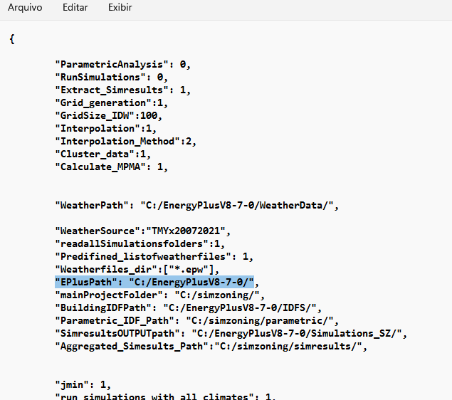
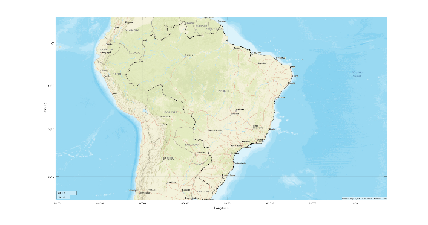
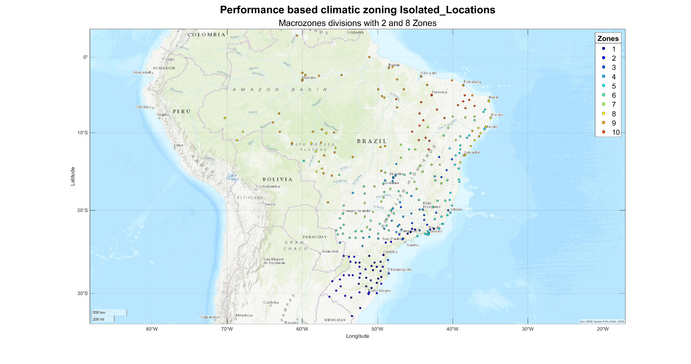
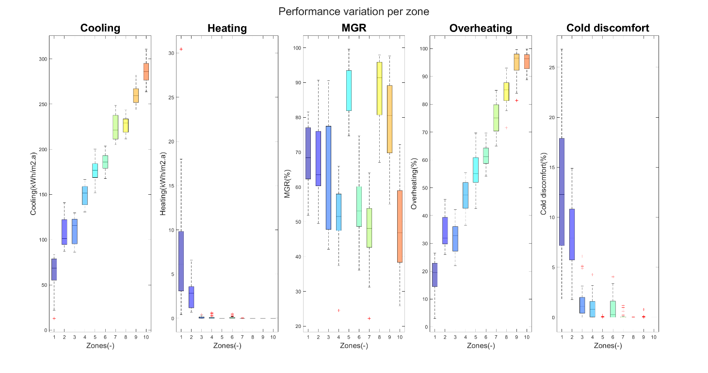
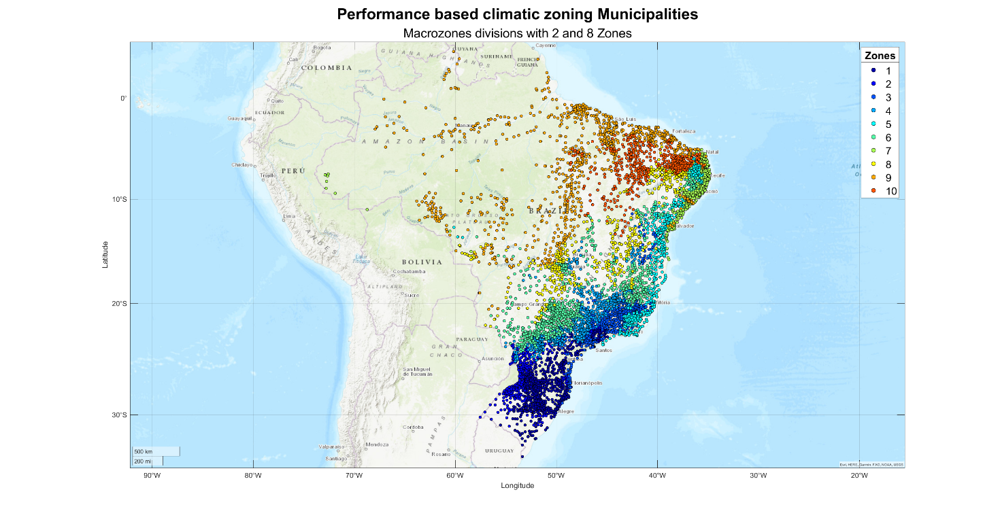
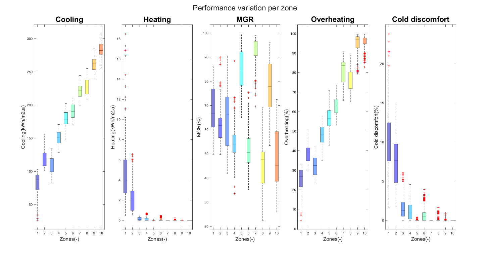
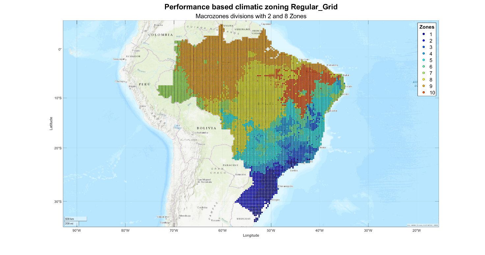
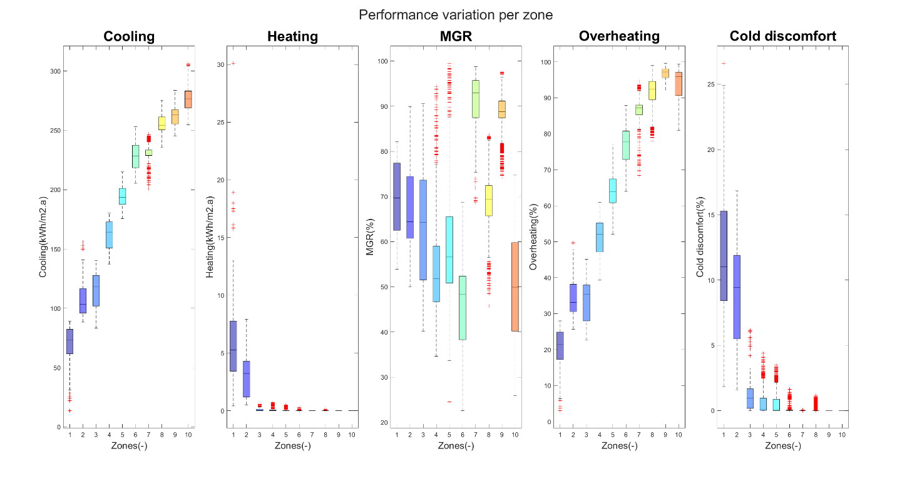
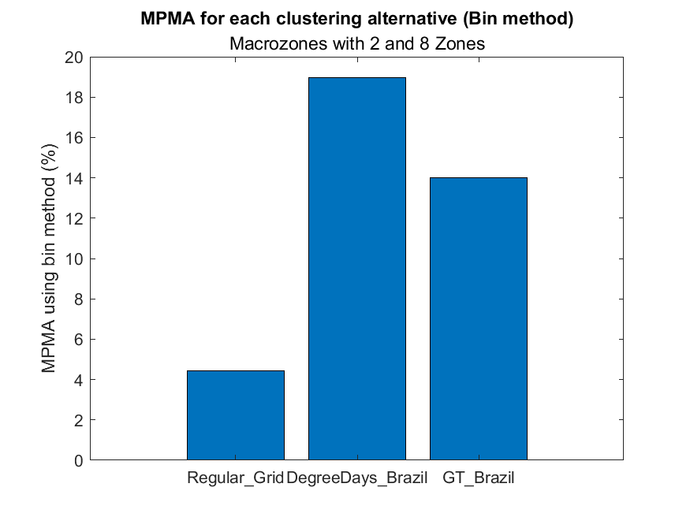

1.  **Example 2 Brazil**

> Zoning of Brazil.
>
> All settings are included in the file BRA_Brazil.zon.
>
> **Files required:**

<table>
<colgroup>
<col style="width: 27%" />
<col style="width: 27%" />
<col style="width: 45%" />
</colgroup>
<thead>
<tr class="header">
<th></th>
<th><strong>File</strong></th>
<th><strong>Location</strong></th>
</tr>
</thead>
<tbody>
<tr class="odd">
<td><ol type="1">
<li><blockquote>

Input file

</blockquote></li>
</ol></td>
<td>BRA_Brazil.zon</td>
<td>simzoning\</td>
</tr>
<tr class="even">
<td><ol start="2" type="1">
<li><blockquote>

Shape file of the States of Florida, Georgia, and Tennessee

</blockquote></li>
</ol></td>
<td>BRAlimits.shp</td>
<td>simzoning\GISfiles\AreaOfStudy\</td>
</tr>
<tr class="odd">
<td><ol start="3" type="1">
<li><blockquote>

Weather files of the area of study

</blockquote></li>
</ol></td>
<td>279 .EPW files</td>
<td>simzoning\Weatherfiles\</td>
</tr>
<tr class="even">
<td><ol start="4" type="1">
<li><blockquote>

Idf files

</blockquote></li>
</ol></td>
<td>
ModelHVAC.idf

ModelNV.idf
</td>
<td>simzoning\IDFs\BRAZIL_IDFS</td>
</tr>
<tr class="odd">
<td><ol start="5" type="1">
<li><blockquote>

EnergyPlus Version

</blockquote></li>
</ol></td>
<td>8-7-0</td>
<td></td>
</tr>
<tr class="even">
<td><ol start="6" type="1">
<li><blockquote>

Alternative method for comparison

</blockquote></li>
</ol></td>
<td>
DegreeDays_Brazil.shp

GT_Brazil.shp
</td>
<td>simzoning\GISfiles\CZ_Methods_Comparison\</td>
</tr>
<tr class="odd">
<td><ol start="7" type="1">
<li><blockquote>

File containing coordinates of Brazilian municipalities

</blockquote></li>
</ol></td>
<td>MunicipiosBrasil.csv</td>
<td>simzoning\</td>
</tr>
</tbody>
</table>

2.  **Steps**

<!-- -->

1.  Create a folder C:/simzoning to unzip simzoning files.

2.  Confirm the path of EnergyPlus Version 8.7 installed in the
    computer. If necessary, rewrite the path in the BRA_Brazil.zon file
    used as input data to run this example.
    

> Figure 1 Input data file BRA_Brazil.zon

3.  Call simzoning from MATLAB with the BRA_Brazil.zon file as input
    data.

<table>
<colgroup>
<col style="width: 58%" />
<col style="width: 41%" />
</colgroup>
<thead>
<tr class="header">
<th colspan="2">Case study summary</th>
</tr>
</thead>
<tbody>
<tr class="odd">
<td rowspan="2"></td>
<td>279 Epws</td>
</tr>
<tr class="even">
<td>
2 models

5 Performance indicators

Macrozones

2 Cold Zones + 8 Hot zones

Time estimation 5 hours
</td>
</tr>
</tbody>
</table>

3.  **Expected results**

> A Region with 10 Zones considering 3 Zoning resolution. A) Clustering
> based on points, b) clustering based on municipalities and c)
> clustering based on interpolated data.

> Figure 2 Clustering considering isolated locations
>
>  style="width:6.07844in;height:3.3in" />
>
> Figure 3 Performance variation of zoning based on isolated locations
>
>  style="width:5.49746in;height:3.3in" />
>
> Figure 4 Clustering based on municipalities

> Figure 5 Performance variation of zoning based on municipalities

> Figure 6 Clustering based on a regular grid of interpolated data
> (Altitude, latitude, and longitude method)

> Figure 7 Regular grid zoning boxplot

> Figure 8 MPMA of clustering results compared to Degree-days and
> GT-zoning for that region.

See the Brazilian case study_AltLatLon_MacrZ_Report.pdf in the
C:\simzoning\Outputs\Brazilian case study_CaseStudy folder for further
details of expected results.
